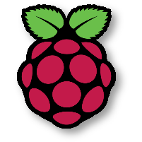

# Running Hugging Face Models on a Raspberry Pi


<div align="center">




**This repository includes detailed instructions and the corresponding code for deploying, serving, and running a Hugging Face model on a Raspberry Pi.**


<br>

***Follow along on YouTube: https://www.youtube.com/watch?v=2rJCGyHQ_zM***

</div>


## Overview

This repository includes detailed instructions and the corresponding code for deploying, serving, and running a Hugging Face model on a Raspberry Pi. We will start from a model card on Hugging Face's model hub and transform it into a microservice accessible with APIs on an edge device. The instructions included in this README are specific to a Raspberry Pi device, but you can follow along with your own preferred remote device (Linux OS with ARM or AMD chip).

Below is a quick overview of this README's contents:

* [Environment Setup](#environment-setup): Set up your Python environment and remote device
* [Hugging Face Model Containerization](#containerize-hugging-face-model): Convert a Hugging Face model into a portable, interoperable Docker container
* [Run Model on Pi with Docker](#run-model-on-pi-with-docker--grpc): Leverage Docker and gRPC to download model to device and make API calls against it
* [Run Model on Pi with Modzy](#run-model-on-pi-with-modzy-edge): Leverage Modzy Edge feature to deploy, serve, and run model with just a few lines of code

## Environment Setup

This section provides instructions for setting up your environment and installing dependencies you will need (both locally and on remote device) to execute the code in this repository.

Start by cloning this project into your directory:

```bash
git clone https://github.com/modzy/hugging-face-raspberry-pi.git
```

### Python Environment Set-up

Next, we will need to set up a Python environment to run the [Jupyter Notebook](./Hugging%20Face%20%26%20Raspberry%20Pi%20Tech%20Talk.ipynb) code and our example [Flask App](./flask-app/README.md).

1. Install Python version >= 3.6
2. Create a virtual environment (venv, conda, or your virtual environment of choice)
3. Activate your virtual environment, and install Jupyter Notebooks using the appropriate [install instructions](https://jupyter.org/install)
4. At a minimum, install the following python libraries to be able to run the [Notebook](./Hugging%20Face%20%26%20Raspberry%20Pi%20Tech%20Talk.ipynb) referenced in the YouTube video recording.

```bash
pip install torch transformers[torch] numpy chassisml modzy-sdk grpcio~=1.50.0 protobuf~=4.21.9 google-api-core~=2.8.1
```

Now, simply open a Jupyter Notebook kernel and begin working with the code.

### Raspberry Pi Set-up

In this section, we will take the steps to properly install an OS onto your Raspberry Pi and install Docker. These are the only two mandatory requirements to download and run our model. 

#### Install Raspbian on your Raspberry Pi
To image your Raspberry Pi from scratch, do the following:
1. Download and install the Raspberry Pi Imager [here](https://www.raspberrypi.com/software/)
2. Insert a microSD card into your comptuer then open up the Raspberry Pi Imager (16GB recommended)
3. Click on "Choose OS" and select `Raspberry Pi OS Lite (64-bit)` (a port of Debian with no desktop that supports Raspberry Pi models 3, 4, and 400)
4. Click on "Choose Storage" then select your microSD card
5. Click on the ⚙️ icon then select the following checkboxes and fill in all necessary info
    * ☑️ Enable SSH (and 🔘 Use password authentication)
    * ☑️ Set username and password
    * ☑️ Configure wireless LAN
5. Click "Save" then click "Write"
6. Eject the microSD card from your computer then slide it into your Pi's microSD card slot
7. Power on your Raspberry Pi, then wait a few minutes
8. SSH into your Pi

```bash
$ ssh pi@raspberrypi
pi@raspberrypi's password:
pi@raspberrypi:~ $
```

9. Finally, update your packages

```bash
$ sudo apt-get update
$ sudo apt-get upgrade
$ reboot
```

#### Install Docker
The easiest way to install Docker on a Raspberry Pi is to use a convenience shell script provided by the nice people at Docker. Full instructions can be found [here](https://docs.docker.com/engine/install/debian/)

```bash
$ curl -fsSL https://get.docker.com -o get-docker.sh
$ sudo sh get-docker.sh
```

To make sure Docker is up and running, you can type the following:

```bash
$ sudo docker ps
CONTAINER ID   IMAGE     COMMAND   CREATED   STATUS    PORTS     NAMES
```

*NOTE: While the following instructions are specific to setting up a Raspberry Pi, you may perform the equivalent steps on the edge or remote device of your choice.*

## Containerize Hugging Face Model

*Note: If you would like follow along in this section of the notebook, you must first create a free account on [Dockerhub](https://hub.docker.com/signup). If, however, you wish to skip this portion, you can use this pre-built [Docker container](https://hub.docker.com/repository/docker/modzy/tinybert-arm).*

Once you have wrapped up setting up your local Python environment and remote device, you can begin experimenting with your Hugging Face Model, Chassis, and gRPC APIs. The [notebook](./Hugging%20Face%20%26%20Raspberry%20Pi%20Tech%20Talk.ipynb) includes instructions for executing the various workflows, but below are additional high-level instructions with more context.

We start by downloading this [TinyBERT model](https://huggingface.co/gokuls/BERT-tiny-emotion-intent?text=I+like+you.+I+love+you) from Hugging Face via the [Transformers](https://huggingface.co/docs/transformers/main/en/index) library. If instead you choose to use a different model, make sure to modify the included code as necessary.

Next, we will leverage [Chassis](https://chassis.ml) to automatically convert this Hugging Face model into a portable and interoperable Docker container. To learn more about Chassis, these resources and guides are a great place to start:
* [Chassis Overview](https://chassis.ml/conceptual-guides/overview/)
* [Build and Publish a Scikit-learn model](https://chassis.ml/tutorials/ds-connect/)
* [Install Chassis with a private docker registry](https://chassis.ml/how-to-guides/private-registry/)
* [Frequently Asked Questions](https://chassis.ml/common-errors/)
* [gRPC Overview](https://chassis.ml/conceptual-guides/grpc/)
* [Full API and SDK Reference](https://chassis.ml/service-reference/)

After following this portion of the notebook, you will have built and published a Hugging Face model container to your Dockerhub account.

## Run Model on Pi with Docker & GRPC

Now that we have built a container image with our Hugging Face model compiled for an ARM chip architecture, we can now download this container to our Raspberry Pi. The first method we will use to do so will use Docker directly. Open a terminal on your Raspberry Pi and run the following command to download the container:


### Download and Spin Up Container

```bash
docker pull modzy/tinybert-arm:1.0.0
```

Note:
* Replace `modzy/tinybert-arm:1.0.0` with your newly built container image if you wish to use your own model or Dockerhub repository
* Depending on how you set up authentication to your Raspberry Pi, you may need to SSH into the machine with a password or private key (e.g., with key: `ssh -i /path/to/key.txt <username>@<ip-address>`, or with password: `ssh <username>@<ip-address>`)

Next, we will spin up this container. Use this command to do so (and modify as needed):

```bash
docker run --rm -it -p 45000:45000 --memory="200m" modzy/tinybert-arm:1.0.0
```

After about a minute or so, you should see the following on the terminal:

```bash
INFO:__main__:gRPC Server running on port 45000
```

This means your container is running, and we can now make gRPC API calls against it.

### gRPC API Calls

Chassis builds containers that supports gRPC APIs. This means there is a gRPC server embedded within the container that can interact with a gRPC client. Unlike REST API calls where you can make unary calls to a specific *endpoint*, gRPC requires a client that is compatible with the server and can interact via Remote Procedure Calls (RPCs). Fortunately, you can automatically generate this client code in your [preferred language of choice](https://grpc.io/docs/languages/) with the same protofile used to generate the gRPC server. See this protofile for Chassis models [here](https://github.com/modzy/chassis/blob/main/service/flavours/mlflow/interfaces/modzy/protos/model2_template/model.proto).

This repository includes the auto-generated client code for Python in the `auto_generated/` directory, so you can run this directly in the [Notebook](./Hugging%20Face%20%26%20Raspberry%20Pi%20Tech%20Talk.ipynb). To run this code, you have two options:

#### Run the code directly on your Raspberry Pi. 

To do so, you'll need to copy the `auto_generated/` folder onto your Pi and copy the following code into a `client.py` file (same directory level as `auto_generated/`):

```python
# import auto generated Python client code to make gRPC API calls to running container
import json
import logging
from typing import Dict
import grpc
from auto_generated.model2_template.model_pb2 import InputItem, RunRequest, RunResponse, StatusRequest
from auto_generated.model2_template.model_pb2_grpc import ModzyModelStub
logging.basicConfig(level=logging.INFO)
LOGGER = logging.getLogger(__name__)

# define run function that wraps the auto-generated RPC calls into a single function call
HOST = "localhost"

def run(model_input):
    def create_input(input_text: Dict[str, bytes]) -> InputItem:
        input_item = InputItem()
        for input_filename, input_contents in input_text.items():
            input_item.input[input_filename] = input_contents
        return input_item

    def unpack_and_report_outputs(run_response: RunResponse):
        for output_item in run_response.outputs:
            if "error" in output_item.output:
                output = output_item.output["error"]
            else:
                output = output_item.output["results.json"]
            LOGGER.info(f"gRPC client received: {json.loads(output.decode())}")

    port = 45000
    LOGGER.info(f"Connecting to gRPC server on {HOST}:{port}")
    with grpc.insecure_channel(f"{HOST}:{port}") as grpc_channel:
        grpc_client_stub = ModzyModelStub(grpc_channel)
        try:
            grpc_client_stub.Status(StatusRequest())  # Initialize the model
        except Exception:
            LOGGER.error(
                f"It appears that the Model Server is unreachable. Did you ensure it is running on {HOST}:{port}?"
            )
            return

        LOGGER.info(f"Sending single input.")
        run_request = RunRequest(inputs=[create_input(model_input)])
        single_response = grpc_client_stub.Run(run_request)
        unpack_and_report_outputs(single_response)

if __name__ == "__main__":
    # generate inputs and send them through run function
    text1 = b"Today is a beautiful day"
    text2 = b"I am very sad"
    text3 = b"The haunted house was terrifying"

    for text in [text1, text2, text3]:
        test_inputs = {"input.txt": text}
        run(test_inputs)
```

Then, run this file:

```bash
python client.py
```

#### Run Locally with SSH Tunnel

If you want to continue running the code in the notebook locally, all you will need to do is set up an SSH tunnel between your local machine and your Raspberry Pi. Since the model container is already running on port 45000 on the Pi, you can set up the tunnel with this command:

```bash
ssh -L 45000:localhost:45000 <user@ip-address-of-pi>
```

Replace `<user@ip-address-of-pi>` with the username and IP address of your device. In doing so, your SSH tunnel will connect and allow you to execute the gRPC client code from within your notebook.

#### Build a custom Flask App

Let's take this client code one step further with an example [Flask App](./flask-app/app.py). Follow these [instructions](./flask-app/README.md) to see how we embed a few lines of gRPC client code into a Flask application we can access in our browser and spin it up yourself! 

## Run Model on Pi with Modzy Edge

In this section, we introduce an alternative that streamlines the first approach through [Modzy's](https://modzy.com) Edge capability, allowing you to scale this model to as many devices as you need, serve and consume them through a standard API, and fully manage the model in production, regardless of where the model is running.

For the full tutorial and instructions, visit https://docs.modzy.com.


